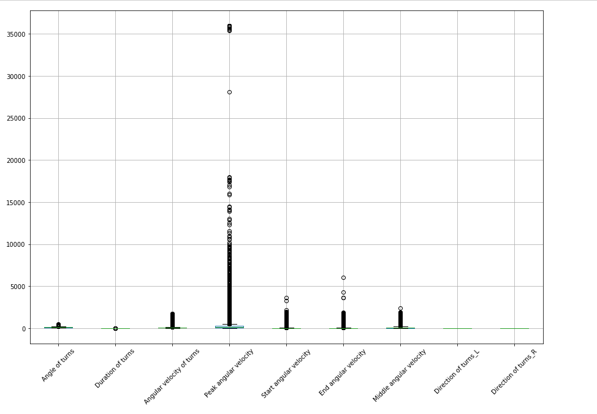
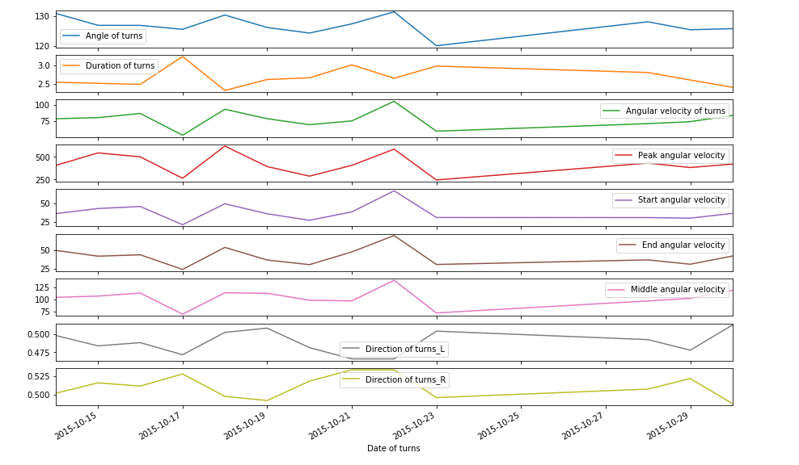

# Exploratory-data-analysis

In preparation to the virtual meeting we think it is best to understand your skill set with a small data analysis challenge. Please find attached data from a single patient with Parkinson's disease who wore an inertial measurement unit for several days on the lower back. An in-house algorithm was used to detect axial turns throughout the day (see time stamp last column) and quantified 8 different parameters:

Direction of turns left/right, Duration of turns in sec, Angular velocity of turns: degree/sec, Peak angular velocity, Start angular velocity within the first part of the turn, End angular velocity (end part), Middle angular velocity (middle part).

The individual tabs in the excel spreadsheet correspond to individual days.

In an ideal world we would like you to provide an exploratory data analysis including but not limited to visualization, data quality checks, descriptive statistics and potential future analysis ideas (if you had e.g. 30 subjects).

The Tasks

1.       Please familiarize yourself with the data set and take notes of any peculiarities you discover throughout working on the dataset.

2.       The Loading module loads the data and performs preprocessing on it

3.       Implement transformation logic using a programming language and libraries of your choice (e.g. pandas, spark, SQL, etc. is acceptable).

4.       Running a python script in a Docker Conatiner

5.       Export the tidy dataset in CSV format

## Generating visualization #1 ( histogram )

This shows that univariant data analysis of outlier

##  Generating visualization #2 ( scatter matrix )

This shows that it is multivariant data analysis. So, I compared the each component among them.

##  Generating visualization #3 ( Box plot )

This shows that Outlier of peak angular velocity using distribution

##  Generating visualization #3 ( Day Trend )

This shows that Outlier of peak angular velocity using distribution

